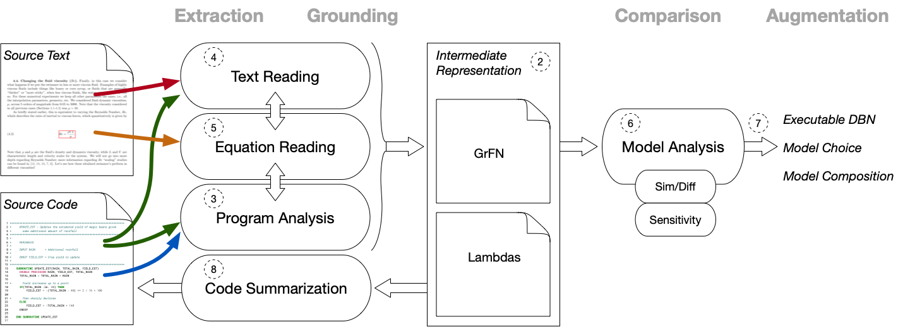

## AutoMATES Architecture Overview

The AutoMATES architecture is summarized in the figure above.

On the far left of the figure are the two information sources that serve
as inputs to the AutoMATES system: documents containing text and
equations that describe scientific models, and source code containing
program instructions and natural language comments that implement the
aforementioned models.

Along the top of the figure are four headings (in grey) that describe
the general type of processing being done by AutoMATES:

1. *Extraction* of information from the input data sources (text and
   source code).
2. *Grounding* the extracted information by linking between information
   types (text, equations and source code) and connecting identified
   terms to scientific domain ontologies.
3. *Comparison* of models by analyzing structural and functional
   (via sensitivity analysis) similarities and differences.
4. *Augmentation* of models by selection of model components appropriate
   for a task, composing model components, and model execution;
   AutoMATES produces executable model components (as dynamic Bayesian
   networks) and provides results of Comparison, but in the ASKE program
   selection and composition will be done manually by humans.

Extraction and Grounding are performed by three interacting pipelines:
Program Analysis, Machine Reading and Equation Reading. 
1. The *Program Analysis* pipeline extracts program source code and
   associated comments and performs an analysis that identifies
   variables and the functional relationships between them, as
   determined by program control flow and expressions. This results in a
   *Function Network* representation of the variable relationships
   paired with modular functions that compute the variable states
   (*Lambdas*). Within the ASKE program, the AutoMATES Program Analysis
   pipeline will focus on extraction and analysis of Fortran source
   code. Additional language processing pipelines can be modularly added
   in the future.
2. The *Machine Reading* pipeline processes text from papers and other
   documents (input as PDFs) describing scientific models as well as
   input comments associated with source code. This pipeline extracts
   contextual information about models, including identifying
   mentions of physical variables and grounding them to domain
   ontologies, and specifics about variable ranges, units, confidence
   scores, etc. Variable mentions identified in comments can be linked
   to mentions in the documents. Machine reading also extracts the
   context of equations, also linking and grounding mentions of
   variables in equations. 
3. The *Equation Reading* pipeline extracts equations from PDFs, first
   identifying the LaTeX source code that could produce the equation
   image, and then mapping the LaTeX representation to a symbolic math
   representation. Equation Reading interacts with the Program Analysis
   pipeline by passing along the symbolic mathematical representation to
   perform the same analysis that extracts the source code Function
   Network and Lambdas, and interacts with the Machine Reading pipeline
   to ground equation variables to their context in the source text
   discourse.

The result of the coordinated Extraction and Grounding pipelines is a
unified, programming language-agnostic intermediate representation that
explicitly links the extracted information in the scientific discourse
context and variables grounded in domain ontologies with the Function
Network and Lambdas extracted in program analysis and equation
extraction.  The *Grounded Function Network* (GrFN) intermediate
representation captures all of this linked information in a form that
permits further model analysis.

Model Comparison and eventual Augmentation is then enabled by the Model
Analysis pipeline. The goal of this pipeline is to take GrFN and Lambdas
representations of extracted source models and their descriptions, and
enable efficient model comparison: identifying what portions of two or
more models share same or similar computations about similar variables,
and which components are different. The GrFN representation is first
analyzed according to the structural properties of the Function Network:
shared grounded variables between two models are identified and the
function network topology is analyzed to identify which computations
involved in setting variable states are similar and which are different.
Then, the Lambdas are incorporated to analyze the functional
relationships between variables in similar networks, through sensitivity
analysis. Because sensitivity analysis can be computationally expensive,
automatic code differentiation will be used to efficiently compute the
derivative (rates of change) of variables with respect to their inputs,
and Bayesian optimization techniques will be used to make estimation of
sensitivity functions require as few samples as possible. The final
product of this analysis (1) includes modular executable
representations of grounded models (as dynamic Bayesian networks), (2)
provides results of model comparison to enable model choice in tasks, and
(3) based on grounded model similarity and differences, enables model
composition.

Finally, the combined, grounded information in the GrFN representation
that is linked to the original source code is the basis for
generating natural language summaries of portions of the original source
code. This can help improve human readability and debugging of the
source code.

The following sections in the remainder of this report describe in
detail the components of the architecture.  The numbers in the
architecture summary figure correspond to the number of the section
providing details about the component.
